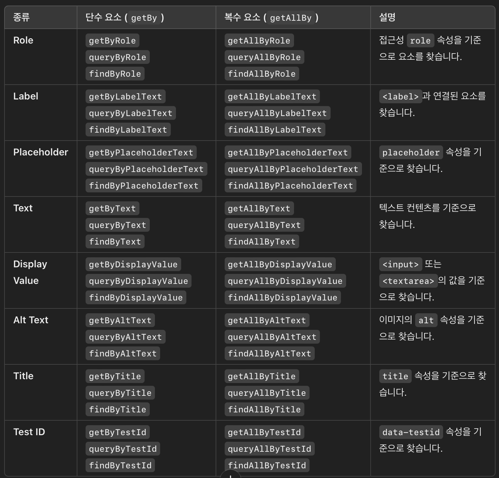

### 단위 테스트란?

<hr/>

### AAA(Arrange-Act-Assert) 테스트 작성 패턴

- Arrange: 테스트를 위한 환경 만들기 ex) 컴포넌트 렌더링
- Act: 테스트할 동작 발생 ex) 입력 등..
- Assert: 올바른 동작이 실행 되었는지 또는 변경사항 검증

```
TIP ⚡️
잘 작성된 테스트코드는 문서가 될 수 있으므로, description을 잘 작성 해야함
```

1. react testing library를 통해 테스팅을 진행하는데 Arrange를 위해 "render" 함수를 통해 컴포넌트를 렌더 시킬 수 있다
2. Assert 단계의 테스팅 대상이 되는 요소에 접근하기 위한 라이브러리를 "query"라고한다,
   

```js
it("className prop으로 설정한 css class가 적용된다", async () => {
  //1. className을 가진 컴포넌트 렌더링
  //2. 클릭이나 메서드를 호출해 prop변경 등등.. (생략)
  //3. 렌더링 후 DOM에 해당 class가 존재하는지 확인

  //1. className을 가진 컴포넌트 렌더링
  await render(<TextField className="my-class" />);

  //3. 렌더링 후 DOM에 해당 class가 존재하는지 확인
  screen.getByPlaceholderText("텍스트를 입력해 주세요.");

  //expect 함수를 통해 기대 결과를 검증
  //toHaveClass는 매처로, 해당 엘리먼트가 특정 클래스를 가지고 있는지 확인
  expect(screen.getByPlaceholderText("텍스트를 입력해 주세요.")).toHaveClass(
    "my-class",
  );

  //frontEnd test는 classname이란 내부 props나 state를 테스트하는 것이 아니라
  //렌더링되는 DOM 구조가 올바르게 변경되었는지 확인한다 -> 최종적으로 사용자에게 보여지는 DOM
});
```

<hr/>

### 테스트 환경과 매처

<hr/>

```
vitest
- global 설정을 true로 하면, 따로 import를 안해줘도됨


jsdom
- nodejs 환경은 브라우저와 다르게 따로 DOM이 존재 하지 않아, nodejs 환경에서도 DOM을 사용하는거처럼 도와주는 환경이다.
- 단위 테스트시 DOM 구조를 보고싶다면 screen.debug() 를 사용해 볼 수 있음
```

### it | test 함수

- 검증하고자 하는 대상의 최종 결과 상태를 예상하여 정의
- 기대 결과 === 실제 결과 => true

### 단언(assertion)

- 테스트가 통과하기 위한 조건을 기술하여 검증을 실행함

### 매쳐

- 기대 결과를 검증하기 위해 사용되는 일종의 API 집합
- vitest는 다양한 기본 매처를 제공하며, 이를 확장하여 단언을 실행할 수 있다.
- 기존의 vitest는 DOM에 접근하는 매처가 없기 때문에 jest-dom라이브러리를 설치하여 사용한다.

### describe

- 테스트를 그룹핑해 묶을 수 있음
- describe 내에서 어떤 함수를 정의했다면 해당 스코프 안에서만 영향을 줌, 즉 독립적인 테스트에 필요한 설정들을 그룹 단위로 구분이 가능함

<hr/>

### setup 과 teardown

<hr/>

```
💡 모든 테스트는 독립적으로 실행되어야 한다
- 테스트의 순서가 바뀐다 해서 결과가 달라지면 신뢰 할 수 없는 테스트임
- 이런 독립성을 보장하기 위해 setup, teardowm을 이용할 수 있음
```

### setup

- 테스트를 실행하기 전 수행해야 하는 작업

```
beforeEach
- 파일 또는 스코프(테스트 컨텍스트)내의 테스트가 실행되기전 실행됨
- 전역에 선언하면 모든 테스트가 실행하기 전에 실행되지만 어떠한 describe, it.. 안에 선언하면 해당 테스트가 실행하기 전에 실행되고 다른 테스트에는 영향을 주지 않음

beforeAll
- beforeEach와 비슷하지만 파일 또는 스코프(테스트 컨텍스트)내의 테스트가 실행되기전 딱 "한 번"만 실행됨
- beforeEach 보다 우선순위임
```

### teardown

- 테스트를 실행한 뒤 수행해야 하는 작업

```
afterEach
- 파일 또는 스코프(테스트 컨텍스트)내의 테스트가 실행 후 실행됨, 초기화 로직으로 사용하면 좋음

afterAll
- afterEach와 비슷하지만 파일 또는 스코프(테스트 컨텍스트)내의 테스트가 모두 실행된 후 딱 "한 번"만 실행됨
```

<hr/>

### React Testing Library

<hr/>

### Spy 함수

- 함수의 호출 여부, 인자 반환 값 등 함수 호출에 관련된 다양한 값을 저장
- 콜백 함수나 이벤트 핸들러가 올바르게 호출 되었는지 검증할 수 있음
- 매처: toHaveBeenCalledWith, toHaveBeenCalled (인자의 차이)
<hr/>
